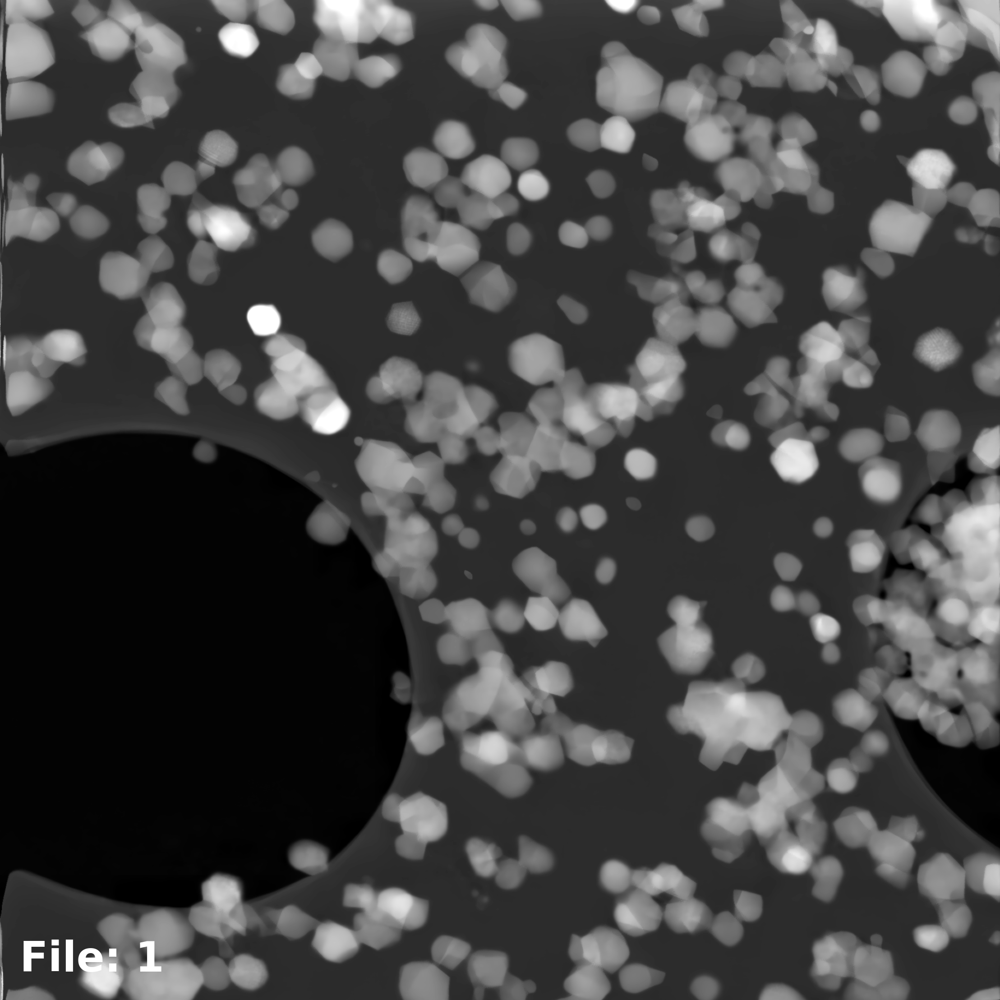
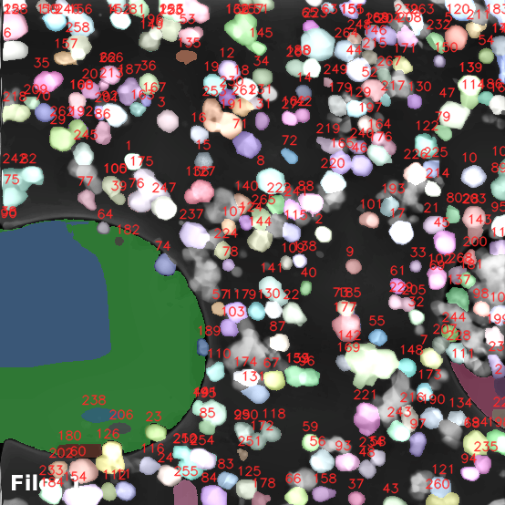
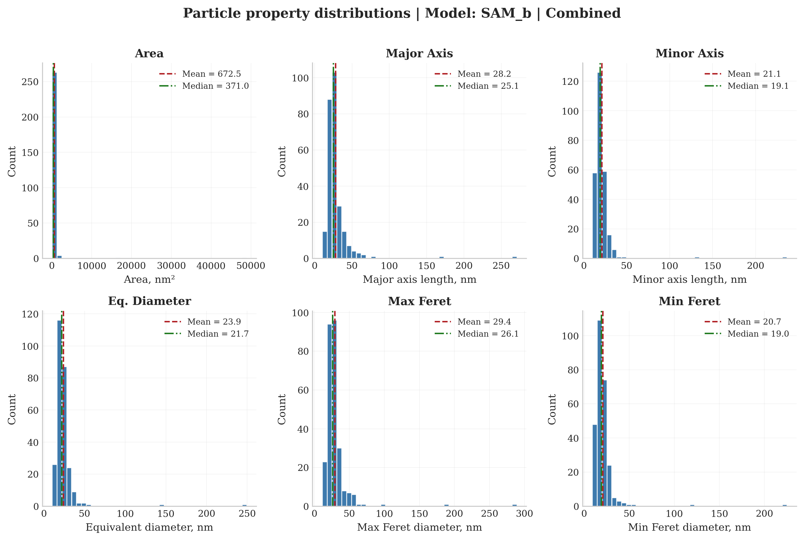

# Image Segmentation and Particle Analysis

Standalone Streamlit application for SEM and TEM image segmentation, particle measurement, and particle size distribution analysis.

This repository is prepared as a standalone app repository. Source code and documentation are tracked. Local data, generated outputs, and model weights are intentionally excluded from git.

## What This App Does

The app provides a full analysis workflow for microscopy images:

- load one or many grayscale images
- optionally apply preprocessing with CLAHE and rebinning
- run segmentation with SAM, SAM2, MobileSAM, FastSAM, or YOLOv8 segmentation models
- extract per-particle masks and measurements
- review overlays, particle crops, and summary statistics
- inspect property distributions and export results

## Tutorial Preview

### 1. Start with a microscopy image

Load a file from the Load tab or point the app to a local folder with images.



### 2. Run segmentation and inspect mask overlays

After model inference, the Results tab shows a native-resolution overlay with particle IDs.



### 3. Review particle property distributions

The Distributions tab aggregates the main metrics used for PSD analysis.



## Repository Layout

```text
streamlit_app/
├── .streamlit/
│   └── config.toml
├── Models/
│   └── .gitkeep
├── docs/
│   ├── images/
│   │   └── tutorial/
│   └── private_github_publish_checklist.md
├── SECURITY.md
├── analysis.py
├── app.py
├── requirements.txt
├── segmentation.py
├── utils.py
├── visualization.py
└── README.md
```

Notes:

- Model weights are expected in the Models directory but are ignored by git.
- Generated outputs are written to segmentation_results locally and are ignored by git.
- The app also supports manually selecting another models folder from the sidebar.

## Installation

### 1. Clone the repository

```bash
git clone <your-repo-url>
cd streamlit_app
```

### 2. Create and activate a Python environment

```bash
python -m venv .venv
source .venv/bin/activate
```

On Windows PowerShell:

```powershell
.venv\Scripts\Activate.ps1
```

### 3. Install dependencies

```bash
pip install -r requirements.txt
```

### 4. Add model weights

By default the app looks for models in:

- ./Models
- ../Models if the local Models folder does not exist

Create the folder if needed:

```bash
mkdir -p Models
```

Supported filenames:

| Model | Filename |
| --- | --- |
| SAM Base | sam_b.pt |
| SAM Large | sam_l.pt |
| SAM2 Large | sam2_l.pt |
| SAM2.1 Large | sam2.1_l.pt |
| MobileSAM | mobile_sam.pt |
| FastSAM X | FastSAM-x.pt |
| FastSAM S | FastSAM-s.pt |
| YOLOv8 Nano Seg | yolov8n-seg.pt |
| YOLOv8 Small Seg | yolov8s-seg.pt |
| YOLOv8 Medium Seg | yolov8m-seg.pt |
| YOLOv8 Extra Seg | yolov8x-seg.pt |

### 5. Launch the app

```bash
streamlit run app.py
```

## Tutorial: End-to-End Workflow

### Step 1. Open the app and configure the sidebar

In the sidebar you set the global analysis parameters:

- models folder
- model type
- compute device: CPU, CUDA, or Apple MPS
- pixel size in nm per pixel
- preprocessing options
- result filtering metric and thresholds

If you already have a valid Models folder, the app will detect available weights automatically.

### Step 2. Load images

Use the Load tab. There are two modes:

- Upload files for drag-and-drop input
- Specify folder path for batch processing from disk

Supported formats include tif, tiff, png, jpg, jpeg, and bmp. The loader also normalizes float32 and uint16 images to uint8 for display and inference.

### Step 3. Apply preprocessing if needed

Use the Preprocess tab to improve segmentation quality before inference:

- CLAHE improves local contrast in low-contrast images
- rebinning downsamples the image for faster processing or different scale behavior

The app keeps track of original, rebinned, CLAHE, and processed images, so exported results preserve the analysis trail.

### Step 4. Load a model and run segmentation

Open the Segmentation tab and:

1. load the selected model
2. verify the chosen device
3. click Run segmentation

During inference the app:

- runs the selected segmentation backend
- extracts per-particle masks and bounding boxes
- computes particle measurements in physical units using the pixel size
- stores everything in session state for the Results, Distributions, and Export tabs

### Step 5. Review segmentation results

The Results tab shows:

- the original processed image
- segmentation mask overlay with particle IDs
- particle crops
- measurement table for the selected image
- summary statistics

This is the best place to inspect detection quality before you export anything.

### Step 6. Explore distributions

The Distributions tab provides:

- combined histograms across detected particles
- configurable histogram settings
- summary statistics for the selected measurement set

Main exported metrics include:

- area
- major axis length
- minor axis length
- equivalent diameter
- max Feret diameter
- min Feret diameter

All pixel-space values are also converted to nanometer-based units.

### Step 7. Export results

The Export tab supports:

- per-image CSV download
- combined CSV download
- ZIP archive generation
- saving the full result package to disk

Saved local outputs are written into a segmentation_results directory with images, masks, crops, metadata, CSV files, and distribution plots.

## Local Output Structure

When you save results locally, the app generates a directory like this:

```text
segmentation_results/
├── crops/
├── csv/
├── distributions/
├── images/
│   ├── raw/
│   ├── processed/
│   ├── rebin/
│   └── clahe/
├── interactive_histograms/
├── masks_overlay/
├── metadata/
├── particle_masks/
└── raw_masks/
```

This directory is intentionally ignored by git because it contains generated outputs and potentially sensitive project data.

## File-by-File Overview

- app.py: Streamlit UI, session state, workflow orchestration, export logic
- segmentation.py: model registry, weight loading, device handling, inference, particle extraction
- analysis.py: particle measurement pipeline and metric conversion
- visualization.py: overlays, crops, distributions, histogram plotting
- utils.py: image loading, normalization, folder scanning, preprocessing helpers

## Troubleshooting

### No models found

- verify that the selected folder contains .pt files with the expected filenames
- use the sidebar to browse to another folder
- if needed, enter a model path manually in the sidebar

### Slow inference

- check whether CUDA or MPS is available in the Device selector
- try rebinning to reduce image size
- use a lighter model such as MobileSAM or YOLOv8n-seg

### Wrong physical sizes

- verify the pixel size value in the sidebar
- confirm that the unit really is nm per pixel for the dataset being processed

### Too many or too few detections

- compare raw vs preprocessed input
- enable CLAHE for low-contrast images
- try a different segmentation model
- filter results in the sidebar using a more appropriate size metric

## Security and Publication Notes

- Do not commit local data, model weights, or generated outputs.
- See SECURITY.md for reporting guidance.
- See docs/private_github_publish_checklist.md before publishing a new remote repository.

## Author

Dmitry Chezganov
